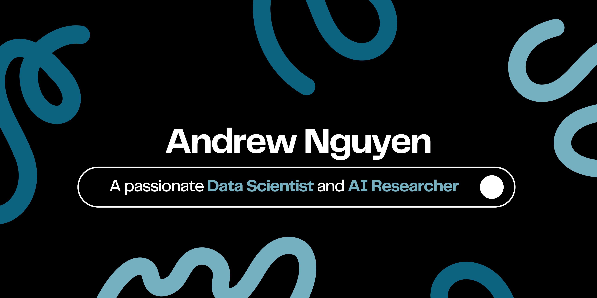

  

- 👨🏻‍💻 I’m currently working on academic research in **[Time Series Forecasting](https://papers.ssrn.com/sol3/cf_dev/AbsByAuth.cfm?per_id=6073192)** at NeuroneLab, **[RMIT University](https://www.rmit.edu.au/about/facts-figures/reputation-and-rankings)**
- 🤖 I'm also an AI Engineer at **[Hitachi Digital Services](https://hitachids.com/)**
- 💬 Ask me about **Python, R, SQL, MS Power Platform, EconFin, and Trading**

- 📫 Reach me at **s3926339@rmit.edu.vn** or **anhnguyen.aiml@gmail.com**
- 📄 Know about my experiences through my **[Curriculum Vitae](https://thequantscientist.github.io/nguyenquocanh.pdf)**

- 🏈 Fun fact: **I am an ex-athlete who enjoys progressive overload and stress. I always smile!**
<h3 align="left">Connect with me:</h3>

<h3 align="left">Languages and Tools:</h3>

  <a href="https://git-scm.com/" target="_blank" rel="noreferrer">        

